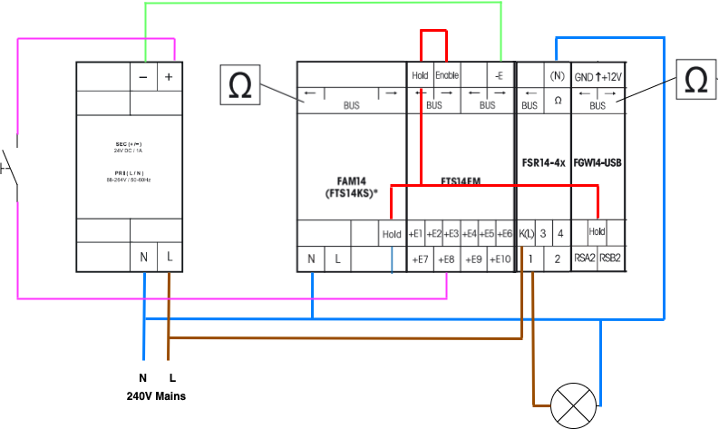
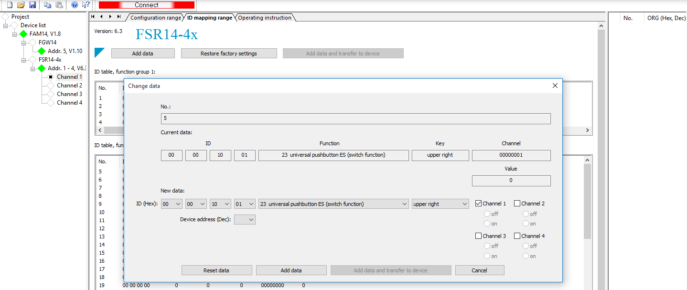
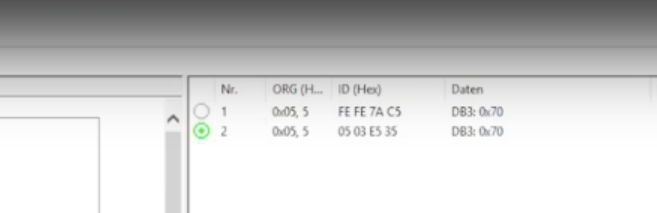
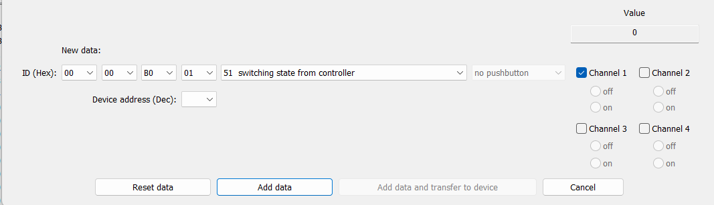
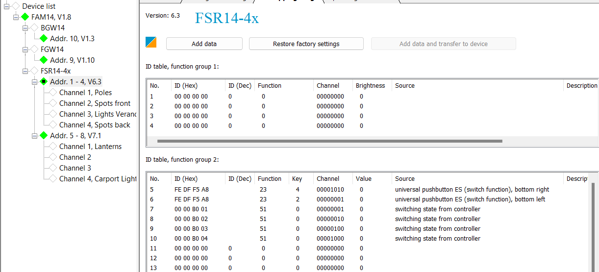

# Eltako-home-automation
This project documents how I'm working on my home automation using Eltako Teleruptors. If you're looking for a modular and reliable way to automate your home, without paying a fortune, read along.

**Keywords**: Distributed, Eltako, Inexpensive, HomeAssistant

## Table of Contents
- [Eltako Home Automation](#eltako-home-automation)
  - [History of this project](#history-of-this-project)
  - [Evaluation](#evaluation)
  - [Test-Bed](#test-bed)
  - [Cabling Diagram](#cabling-diagram)
  - [Programming the Eltako Bus](#programming-the-eltako-bus)
    - [Erase & Clear devices](#erase--clear-devices)
    - [FSR14 erase the bus address](#fsr14-erase-the-bus-address)
    - [Erase FSR14 taught-in settings](#erase-fsr14-taught-in-settings)
    - [Clearing the FGW14](#clearing-the-fgw14)
  - [PCT14](#pct14)
  - [Device Address Assignment](#device-address-assignment)
  - [Programming FTS14EM inputs](#programming-fts14em-inputs)
    - [Setting the buttons](#setting-the-buttons)
    - [Testing the buttons](#testing-the-buttons)
    - [Programming the RS485 ID](#programming-the-rs485-id)
    - [Teaching without PCT14](#teaching-without-pct14)
    - [Teach-in a sensor to a channel of the FSR14](#teach-in-a-sensor-to-a-channel-of-the-fsr14)
  - [Learning and assigning other sensors](#learning-and-assigning-other-sensors)
  - [FGW14-USB: The gateway to an external controller](#fgw14-usb-the-gateway-to-an-external-controller)
- [Home Assistant Eltako Integration](#home-assistant-eltako-integration)
  - [Installing helper Add-ons](#installing-helper-add-ons)
  - [Verify the Eltako FGW14-USB connection](#verify-the-eltako-fgw14-usb-connection)
  - [Install the Home Assistant Eltako Integration](#install-the-home-assistant-eltako-integration)
  - [Build the Eltako Integration Configuration](#build-the-eltako-integration-configuration)
  - [Teach-in you HA lights into your eltako FSR](#teach-in-your-ha-lights-into-your-eltako-fsrs)
  - [Wrapping up](#wrapping-up)


## History of this project
The electricity in my house is centrally switched using Eltako 12-series teleruptors (relays if you will). 
The teleruptors toggle on/off whenever they receive a short low voltage pulse.

Since all switching is happening in the closet, I was able to attach a Raspberry Pi, and send those pulses to play with the lights in the house using software.
It allowed me to automatically turn on or off lights at certain hours of the day, and even do home presence simulation where lights turn on depending on when the sun sets.

Worked great, except when someone toggles a light using a wall switch. The Raspberry Pi can't be informed that a wall switch sent a pulse, while it's connected to that same teleruptor.
Unless, if all wall switches their signal would be routed to the Raspberry Pi, and the Pi is the only one connected to all Teleruptors. 
Not an ideal situation, and not good for the "wife-acceptance-factor" when the Pi would crash/fail. Another solution was needed.

## Evaluation
My requirements are:
1. Being able to use the same wall switches without recabling everything
2. Preferrably no central controller which if it fails, the lights can't be operated properly anymore (wife-acceptance-factor! :) ) If no other option, it should be quickly replaceable without long 'downtime'.
3. Ability to control it through software and do home automation

Requirement 1 and 2 kept me with Eltako: the Series-14 that use the EnOcean Protocol.
Requirement 3 brought me to home assistant.

## Test-bed
Components in use are:

- **WNT12 12VDC-24W/2A**: The powersupply for the wall pulse switches connected to the fts14EM [Specification](https://www.eltako.com/fileadmin/downloads/en/_specifications/17_Technical_Data_Switching_Power_Supply_Units_and_Wide_range_Switching_Power_Supply_Units.pdf) [Datasheet](https://www.eltako.com/fileadmin/downloads/en/_datasheets/Datasheet_WNT12-12VDC-24W_2A.pdf)
- **Eltako FAM14**: The powersupply and controller of the EnOcean bus [Manual](https://www.eltako.com/fileadmin/downloads/en/_bedienung/FAM14_30014000-7_gb.pdf) [Datasheet](https://www.eltako.com/fileadmin/downloads/en/_datasheets/Datasheet_FAM14.pdf)
- **FTS14EM**: The input where the existing wall switches are connected to [Manual](https://www.eltako.com/fileadmin/downloads/en/_bedienung/FTS14EM_30014060-3_gb.pdf) [Datasheet](https://www.eltako.com/fileadmin/downloads/en/_datasheets/Datasheet_FTS14EM.pdf)
- **WNT12**: A 12VDC power supply powering the FTS14EM connections to the wall switches [Manual](https://www.eltako.com/fileadmin/downloads/en/_bedienung/WNT12_20000060-1_internet_gb.pdf) [Datasheet](https://www.eltako.com/fileadmin/downloads/en/_datasheets/Datasheet_WNT12-24V_DC-24W_1A.pdf)
- **FSR14-4x**: A 4-channel teleruptor to which lights are connected [Manual](https://www.eltako.com/fileadmin/downloads/en/_bedienung/FSR14-4x_30014001-1_gb.pdf) [Datasheet](https://www.eltako.com/fileadmin/downloads/en/_datasheets/Datasheet_FSR14-4x.pdf)
- **FGW14-USB**: A USB connection to let Home Assistant send and receive messages on the EnOcean RS485 bus [Manual](https://www.eltako.com/fileadmin/downloads/en/_bedienung/FGW14-USB_30014049-1_gb.pdf) [Datasheet](https://www.eltako.com/fileadmin/downloads/en/_datasheets/Datasheet_FGW14-USB.pdf)

## Cabling Diagram
Despite some people's claims that the Eltako documentation is clear, I tend to disagree with it. It may be all there, but it's all scattered over the place, and not always easy to understand unless you did it before.

Below you can find my cabling diagram:



Connect the `Hold` connection to the all other `Hold` connections across the entire bus. Connect also the 1st FTS14EM (and every 10th) `Enable` connection to the `Hold`.
Make sure the terminator is installed on the last component of the bus. 

The 12VDC `+` and `-` are cabled to the FTS14EM. The `+` goes to a wall switch - which is further connected to the `+E` input connectors, and the `-` is connected to the `-E` input. 

When all is ok, connect the WNT12 and FAM14 to the mains.

With the circuit cabled, we can now start programming the FAM14.

## Programming the Eltako Bus

### Erase & Clear devices
While I was fighting the PCT14 tool, I quickly learned that as you mess around, some settings may get stuck and prevent you from achieving what you originally wanted.
You also can't guarantee that the component you use isn't a return from a previous customer which may still have some settings.

As such, it's recommended to start with a full clear of the components.

#### FSR14 erase the bus address
1. Turn the middle rotary switch to CLR, and then ALL.
2. The LED is flashing quickly
3. Within 10 seconds, turn the upper rotary switch 6 times all the way to the left (anti-clockwise) and away again
4. When successful, the LED will stop flickering and go out after 5 seconds
5. The FSR14 can now be found again for address assignment

#### Erase FSR14 taught-in settings
1. Set the bottom switch to a channel you want to clear, or to 1..4 for all channels
2. Move the middle rotary switch to CLR and then ALL or 1..4. ALL will clear all channels, 1..4 only the channel selected with the bottom rotary switch
3. The LED is flashing quickly
4. Within 10 seconds, rotate the top rotary switch 3 times to the far right side and away again
5. All taught-in sensors of the relevant channel are cleared

#### Clearing the FGW14
1. Turn the rotary switch 5 times to the right (clockwise) and back again within 10 seconds
2. The LED lights up for 10 seconds and then goes out
3. All IDs are cleared


### PCT14
In the absense of a Windows PC, I have installed Virtualbox 6.1 (7.0 didn't work for some reason I didn't further investigate) on an intel MacBook. 
I installed Windows 10 as a VM.

Once the FAM14 is powered on, and connected through USB to the macbook, you can add a USB filter in the VM.
Select the `FTDI FT232R USB UART [0600]`, which is the FAM14. Once added, restart the VM.

On the FAM14, put the BA rotary switch to position 2, and the AUTO rotary switch to 1.

Then in PCT14, you should be able to click `Connect`.

### Device Address Assignment
1. In the left pane of PCT14, right-click and choose `Search device for address assignment`
2. This should bring up the FAM14
3. FSR14: turn the middle rotary switch to LRN on only 1 FSR actuator at a time
4. In the left pane of PCT14, right-click and choose `Search device for address assignment` again
5. This should bring up the FSR14 as well
6. Right-click the FSR14, and select `Modify device address and transmit`. Chose an address that's not in use yet (default is 0, and choose something else now)
7. For each channel you can modify the description
8. Once you're done, change the middle rotary switch to `Auto`
9. Next, teach-in the FGW14, move the rotary switch somewhere and back to 10 so it's blinking green
10. In the left pane of PCT14, right-click and choose `Search device for address assignment` again
11. You should now also see the FGW14 showing up
12. Also change its address

Repeat as needed for extra devices.

=> Now we can write the configuration

Right-click the `Device List` in the left pane, and select `Update device list and read out device memory`.

All devices should be visible in the left pane, and in the color green.

The FTS14EM is a special one. It allows you to connect wired switches and convert those pulses to RS485 bus messages.
You will **not** see it in the PCT14 tool. In fact, programming it is different again.

### Programming FTS14EM inputs
#### Setting the buttons
The FTS14EM has two rotary switches. The bottom one defines to which group an FTS14EM belongs. In total there are 5 groups (1, 101, 201, 301, and 401) in which 100 IDs are available.
It has two halves, labeled `UT` or `RT`. The `UT` side is used for `Universal` Buttons (on/off), the `RT` is for `Directional` Buttons (up/down).

The top one defines the ID of the FTS14EM in the group. As such, there can be 10 FTS14EM's in 1 group.

In our setup, we have set the top one to 0, and the bottom one to 1 in the UT section.

#### Testing the buttons
To test if the electrical wiring is ok, you can close the contact once when the PCT14 tools **NOT** connected to the FAM14.
When the contact is closed, you should see top rotary switch light up briefly.

#### Programming the RS485 ID
Since the FTS14EM does not show up in PCT14, you need to manually go and edit the actuator upon which hex ID it will respond.
First we will explain how to do this using PCT14, and then we will explain how to do it without PCT14, arguably a more reliable approach.

The RS485 hex IDs for each FTS14EM input follow a common structure: `00 00 1x xx`
> Hex Id structure of the FTS14EM: 00 00 1x xx

`x xx` depends on the position of the two rotary switches and the relevant +E input:

- `x --`: The first x represents the position of the bottom switch. Eg: 1 => 1 xx
- `- x-`: The second x represents the position of the top switch. Eg: 2 => x 2x
- `- -x`: The third x represends which +E connection you need. Eg: +E5 => x x5

This together would give HexID: `00 00 1125`.

In our example, we assume that we have the following addresses:

| Connector | Hex ID      |
|-----------|-------------|
| +E1       | 00 00 10 01 |
| +E2       | 00 00 10 02 |
| +E3       | 00 00 10 03 |
| +E4       | 00 00 10 04 |
| +E5       | 00 00 10 05 |
| +E6       | 00 00 10 06 |
| +E7       | 00 00 10 07 |
| +E8       | 00 00 10 08 |
| +E9       | 00 00 10 09 |
| +E10      | 00 00 10 10 |

Now, in PCT14, go to the FSR14 actor you want to control using an FTS14EM input.
Select the `ID mapping range` tab, and edit the bottom table (function group 2).

Double click one line, edit as new ID the relevant hex ID, the right function, and swlect which channel on the actor you want to activate.

In the below example you see how I linked the pulse switch connected to FTS14EM's +E1 connector (00 00 10 01) to control my FSR14-4x, channel 1.

Since I use mono-stable pulse switches, I use the function `23 universal pushbutton ES`. The key is not important here, but the channel is!
When done, click on the `Add data and transfer to device`.

### Calculate the FTS14EM Hex value via Excel:
You can easily calculate the hex value with the Excel file: FTS14EM/Eltako-FTS14EM-HEX-Calculator.xlsx
Select the group (lower rotary switch) via DropDown. And select the decade (upper rotary switch) via DropDown. You will get the hex values for -E1 to -E10 as a result.


### calculate the FTS14EM Hex value based on what you see:
Group = lower rotary switch
Decade = upper rotary switch
E = Input -Exx

1000+(Group-1)+Decade+E=Result
1000+(401-1)+90+10=1500
Write 4 zeros before the result: 00 00 15 00



#### Teaching without PCT14
Sometimes the easiest way is to do it on the devices directly, and use the PCT14 tool just to read out things and export the configuration.
The following steps describe how to manually teach-out or teach-in.

#### Teach-in a sensor to a channel of the FSR14
If you haven't already, make sure the FSR14's channel has no active inputs to it that may disrupt what you're trying to do.
If in doubt, review the settings in PCT14, or just erase the channel as described above.

1. Set the top rotary switch to the relevant function (0 -> direction button, 5 -> universal push button ES, 45 -> central all-on button, 90 -> centrall all-off button)
2. Set the bottom rotary switch to the channel you want to respond when the sensor gets activated
3. Set the middle rotary switch to LRN
4. The LED is flashing quickly
5. Activate the sensor (and only the one you want!!)
6. The LED will go off as a signal the device has taught the new sensor as input
7. Rotate the middle button back to Auto
8. The bottom switch doesn't matter, it's only used for teaching in or out

You can now connect PCT14, and read out the device memory. You should see similar information in the ID mapping tab.

### Learning and assigning other sensors
The great thing about the FAM14 is that it actually enables a wireless bus. Eltako has sensors and wall switches that can be attached to the wall without any need for wiring, as long as they are within wireless reach of the FAM14 antenna.
Each wireless device is different, but most of them have their ID on the backside written. You can use it in a similar way than the previous section to link it to behaviour of the actuators.

Another trick that can be used is live monitoring. In the right pane of the PCT14 tool, you right-click and choose `ID detection - on` .
You then get to see in the right pane hex ids of devices sending on the bus.



The green dot signifies an actual active message (eg: button press).

### FGW14-USB: The gateway to an external controller
Finally, now that the everything is configured and working well, we want all the traffic on the RS485 bus to be visible to an external controller,
like HomeAssistant, OpenHAB, ... etc. That's why we have the FGW14-USB component in the setup.
Turn it the rotary switch BA to position 5, and you see it light up every time a message is sent on the bus. Try to turn on/off a light, you will see it.
All devices should be visible in the left pane, and in the color green.
Note: Position 5 is used for "Eltako Series 14 RS485 Bus <-> USB @ 9600 baud" and Position 6 for "Eltako Series 14 RS485 Bus <-> USB @ 58K baud". This may vary from case to case and depends on your setup.

If that's working well, we are ready to move on to the next step: home assistant integration.

## Home Assistant Eltako Integration
### Installing helper Add-ons
Some Add-ons only show up when you have Advanced Mode turned on. To do this, click on your name to go to the profile page, and enable `Advanced Mode` there.
Go to Settings > Add-ons and add the following useful Add-ons:
- Studio Code Server (to edit your configuration files, automatically validated)
- Terminal & SSH (make sure you edit the add-on configuration in yaml to make it work, I never managed using the UI)

### Verify the Eltako FGW14-USB connection
Using the `HA CLI` you can search for FGW14-USB. Remember from above that we see the Eltako USB equipment as FTDI FT232R equipment.

```commandline
[core-ssh ~]$ ha hardware info | grep -A 1 FTDI_FT232R
    ID_SERIAL: FTDI_FT232R_USB_UART_AQ01GFIV
    ID_SERIAL_SHORT: AQ01GFIV
--
    DEVLINKS: /dev/serial/by-id/usb-FTDI_FT232R_USB_UART_AQ01GFIV-if00-port0 /dev/serial/by-path/platform-3f980000.usb-usb-0:1.5:1.0-port0
    DEVNAME: /dev/ttyUSB0
--
    ID_SERIAL: FTDI_FT232R_USB_UART_AQ01GFIV
    ID_SERIAL_SHORT: AQ01GFIV
--
  by_id: /dev/serial/by-id/usb-FTDI_FT232R_USB_UART_AQ01GFIV-if00-port0
  children: []
```
=> This shows that the Eltako bus is connected to `/dev/ttyUSB0`. We will need this later.

### Install the Home Assistant Eltako Integration
[Philipp Grimm](https://github.com/grimmpp) has made this beautiful integration. You can follow the steps outlined [here](https://github.com/grimmpp/home-assistant-eltako). In summary what you need to do first is:

- Install [HACS](https://hacs.xyz/)
- Add the the git repo to HACS by clicking [here](https://my.home-assistant.io/redirect/hacs_repository/?owner=grimmpp&repository=home-assistant-eltako&category=integration)

:exclamation: If you try to enable the integration already now, **IT WILL NOT WORK YET!**

### Build the Eltako Integration Configuration
Using your favourite approach or editor - I recommend the Visual Studio Server extension in the browser - open the `/config/configuration.yaml` file. The integration searches for a key called `eltako:`. That's where you start.

:exclamation: **Do not try and load the integration until you are at the end of this section. It will not work, since the integration requires certain configuration elements to be present and we will only have them at the end after we walked through the entire process.**

```yaml
eltako:
```

The first thing we need to configure is a gateway. A gateway is the logical device through which communication between your Eltako hardware and Home Assistant occurs. In our setup, we use the `FGW14-USB`.

A sub-key `gateway:` is required which needs its own id because the integration supports more than 1 gateway, and gateway type. The supported types are documented [here](https://github.com/grimmpp/home-assistant-eltako/tree/main/docs/gateways). Therefor, each gateway you would add has its own number in HA (field `id`), `device_type`, and `based_id`. The base_id is actually not that important and doesn't need to match your real FAM14 id. It is only used for checking misconfigurations at start.

```yaml
eltako:
  gateway:
    - id: 1
      device_type: fgw14usb # Supported gateways: fam14, fgw14usb
      base_id: FF-AA-80-00
```

Now each gateway is responsible for their own set of devices (lights, switches, sensors, ...). So we add those to the gateway:

```yaml
eltako:
  gateway:
    - id: 1
      device_type: fgw14usb # Supported gateways: fam14, fgw14usb
      base_id: FF-AA-80-00
      devices:
        light:
        ..
        binary_sensor:
        ..
        switch:
        ..
        cover:
        ..
        sensor:
        ..

```
The supported types of devices are what are the basic types available in Home Assistant, they are not specific to the Eltako integration. In our setup, we are only interested in `lights` which are powered through the FSR14-4x teleruptors (see above). As such, we only keep the `light:` key, and start adding Eltako devices under lights:

```yaml
eltako:
  gateway:
    - id: 1
      device_type: fgw14usb # Supported gateways: fam14, fgw14usb
      base_id: FF-AA-80-00
      devices:
        light:
          - id: 00-00-00-01
            eep: M5-38-08
            name: Poles Garden
            sender:
              id: 00-00-B0-01
              eep: A5-38-08
```
Let's break this down a bit because the first time I saw this, I was not sure what I was looking at either. 

The first thing is `id: 00-00-00-01`. Remember, when you added your first FSR14, you assigned it an address. Most likely you started off with address `1`. When you added your second FSR14, address `2` was not available, because each channel of the FSR14 takes an internal bus address. An FSR14-4x has 4 channels, so when you assigned the FSR14-4x address 1, addresses 1 til 4 will be in use. So `id: 00-00-00-01` effectively refers to Eltako bus id 1. 

:exclamation: Be careful, **addresses in PCT14 are decimal (base10)** whereas the **configuration is hexadecimal (base16)**. As such, if you entered address `250` in PCT14, you would need to reference it as `id: 00-00-00-FA`.

The second line is `eep: M5-38-08`. This tells the integration that we are dealing with a light controlled by an FSR14 actuator. Eltako uses the concept of EnOcean Equipment Profiles (EEPs). [This schema file](https://github.com/grimmpp/home-assistant-eltako/blob/main/custom_components/eltako/schema.py) helps you figure out which type of device supports what EEP. For the light type of device you would look at the `LightSchema` class:

```python
class LightSchema(EltakoPlatformSchema):
    """Voluptuous schema for Eltako lights."""
    PLATFORM = Platform.LIGHT

    CONF_EEP_SUPPORTED = [A5_38_08.eep_string, M5_38_08.eep_string]
    CONF_SENDER_EEP_SUPPORTED = [A5_38_08.eep_string]
```

This tells us that we can put `A5-38-08` or `M5-38-08` as EEP, but only `A5-38-08` is supported as a SENDER_EEP. More about that in a bit. Eltako has its own detailed overview of what device supports what EEP [here](https://www.eltako.com/fileadmin/downloads/en/_main_catalogue/Gesamt-Katalog_ChT_gb_highRes.pdf) but the supported devices and their EEPs are documented on the [Eltako integration repo](https://github.com/grimmpp/home-assistant-eltako/blob/main/README.md).

Finally, we have the mandatory `sender:` section per light. Each `sender` has a sender `eep` (see the schema file for which ones are supported!!) and a sender `id`. **This** id is very important as it is the **sender** of the commands to your Eltako system. And because it is sending commands, it needs to be taught-in to your FSR14. Once taught-in, you will be able to control your lights using HA.

### Teach-in your HA lights into your Eltako FSRs
So right now, you should have a configuration file with at least one light, matching an FSR14 channel, with logical IDs.

For our light `Poles Garden`, we assigned the sender id `00-00-B0-01`. The easiest way now is to open PCT14, select the FSR (Guess which one? Do you see how easy logical numbering helps? Right, the first one! Keep It Simple...Always!), and go to the `ID mapping range` tab in the middle screen.

Double-click the first free line in the `ID table, function group 2` table. Enter the ID of the HA light you want to teach in (here I'm adding `00-00-B0-01`), set the function to `51 - switching state from controller`, and finally choose the channel your light is attached to.



Do this for all your lights, until you have your table complete.



Notice the blue-orange square at the top in the middle pane. This indicates the changes are only local in PCT14, not yet written to the actuators. Connect the PCT14, and click on the `Add data and transfer to device` button to write the configuration into the actuators.

### Wrapping Up
Right now, the integration should work. It's time to add the integration and test it out. 

❗Each time a significant change is made, it's best to restart HA Core. I do that using the terminal and executing the command `ha core restart`.

If you didn't make any mistakes, you will see HA reflect the status of your FSR14 teleruptors AND you will be able to control them from within HA.
If something doesn't work, you can set the logs to detailed and review what's happening:

```yaml
logger:
  default: info
  logs:
    eltako: debug
```

Congratulations! The hard part is over. Now you can play around and leverage the other integrations HA gives. It is now very easy to start automating things! Go have a look at the Settings > Automations & scenes, and play around. HA made it so simple you will have your lights controlled by time of day or even the state of the sun within minutes. Yep, when the sun sets, my garden poles start shining. 

Thank you Eltako, Home-Assistant.io developer team, Philipp Grimm for leading the Eltako integration, and countless other invisible heroes for making this possible!

## References
- [Operating manual for Series 14 DIN tail mounted devices](https://www.eltako.com/fileadmin/downloads/en/_bedienung/Series_14_RS485_Bus_DIN_Rail_Mounted_DevicesSeries_gb.pdf)
- [Philipp's integration repo with lots of documentation](https://github.com/grimmpp/home-assistant-eltako)
- [The big discussion that revived Eltako on HA @ the HA Forum](https://community.home-assistant.io/t/eltako-baureihe-14-rs485-enocean-debugging/49712)
